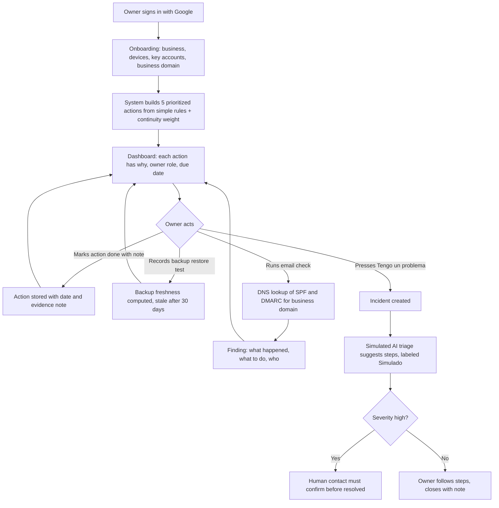
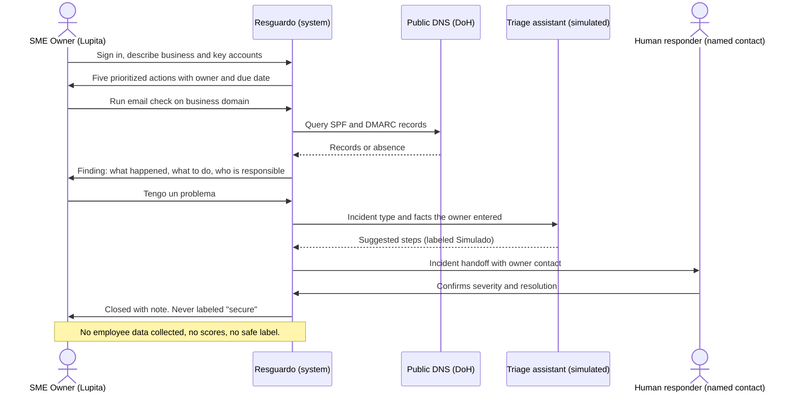

# PACKET, Resguardo (Week 8, Business Bending)
### Emilio Gomez Gonzalez, ADVERSARY, Team 1
### Chapter 7, Quantum Genocide. Declared vacuum: SME SHIELD

## Problem, in my own words

The chapter's pattern is not quantum, it is asymmetry: attack capability arrives before defense, and one motivated actor outruns every institution. In Mexico that is already true. A single attacker using AI coding tools exfiltrated 195 million identity records from nine government agencies, and defense is still priced and staffed for corporations. Reports in 2026 say more than half of Mexican PyMEs have had at least one cyber incident and about three quarters would have operations paralyzed by one, while the owner usually has no IT person and no plan.

The existing products are not absent, they assume an environment the owner does not have. Microsoft Defender for Business is $3 per user per month, but it lives inside Windows and Microsoft 365, and a papeleria whose whole stack is one Android sales tablet, WhatsApp Business, a Gmail account and a Facebook page has no endpoint to attach it to. The gap is not "no product exists", it is "no operating layer exists": nobody tells the owner which five things to do this week, checks that they were done, and answers the phone when something breaks. Resguardo is that layer, not a scanner.

As the team's Adversary I am building the slice that has to survive my own kill criteria: it must not create false confidence, must not become surveillance, and must justify a monthly price against avoided downtime.

## Exact user

**Lupita, 46**, owns a papeleria-cafeteria with 4 employees in Naucalpan. Her stack: one Android tablet for sales and a card terminal, WhatsApp Business for orders, one Gmail account for the business, a Facebook page, and photos of invoices in Google Drive. She is not a technologist and does not want to become one. She has never had an incident, and if she did, she would not know whether to call the bank, her nephew, or nobody. She will not buy "cybersecurity", but she would pay a small monthly amount so that a bad week does not close the shop.

## Success definition

Before this module closes: Lupita signs in with Google, describes her business in under three minutes, and sees exactly **five prioritized actions**, each with a plain-language reason, a named responsible person, and a due date. She can mark an action done with a short note, record a **backup restore test**, run a **real email-spoofing check** on her business domain, and press **"Tengo un problema"** to open an incident that shows what to do now and who the human responsible is. The app never says "safe": its best state reads "No known findings, this does not mean you are secure". All of this works end to end on the live URL.

## Mockup

AI-generated image (docs/mockup.png): the main screen showing the five prioritized actions with status chips and an owner per action, the permanent "Lo que Resguardo NO protege" panel, and the incident button. The built dashboard follows this layout.

## The world's best attempt (benchmark)

The best existing solution on Earth for turning a small-business security baseline into an actionable, checked program is the UK government's **Cyber Essentials** scheme (NCSC): five technical controls (firewalls, secure configuration, user access control, malware protection, patch management), certification from about GBP 320 to 440 plus VAT for small firms, with free cyber liability insurance and an incident helpline attached for eligible UK organisations. The scheme got the mechanism right: a short, fixed, auditable list of controls instead of a platform. It got the delivery wrong for this user: it is a yearly questionnaire reviewed by an assessor, not an operating layer, it is English and UK-specific, and it assumes an IT environment. Resguardo localizes the same idea: the fixed short list becomes five rotating weekly actions for an Android-and-WhatsApp stack, verified by evidence the owner attaches, with a human incident path instead of an annual certificate.

## The long view (3 years)

If this slice works, Resguardo becomes the standard operating layer for Mexican micro and small businesses outside the Windows ecosystem: a monthly subscription that a payment processor or insurer can offer as a bundle, because a verified baseline lowers their loss exposure. The breach-victim layer the team preserved plugs in later as a complementary module, so an owner can also learn whether the business or her own data appeared in a leak, using privacy-preserving checks. The human-responder network (consultants and IT students paid per incident, assisted by AI triage) is the part that scales to thousands of shops without pretending software alone protects anyone.

## Blueprint conditions and how this build honors them

| # | Condition (Team 1 Blueprint) | Design decision in Resguardo |
|---|---|---|
| 1 | Affordable for an SME | Free tier of every service; priced concept (monthly) shown on a "continuity math" card comparing a plan to the cost of a closed week. |
| 2 | First version stays narrow | Exactly five actions, no scanning of devices, no agents, no promise of "complete" security. |
| 3 | Every alert leads to an understandable action | Each finding has three fields: what happened, what to do, who is responsible. |
| 4 | Human responsibility cannot disappear | AI triage is simulated and labeled; any incident ends in a named human contact, and "high" severity requires human confirmation before the app calls it resolved. |
| 5 | **Shadow clause**: minimum telemetry, no employee surveillance or scoring, show what it does not protect | The schema has **no employee table and no per-person score**. Inventory is by device and account role. "Responsible" is a free-text role label on an action, never a metric. A permanent panel lists what Resguardo does NOT protect. |
| 6 | No false security | Banned wording: "seguro", "protegido" as a status. The best status is "Sin hallazgos conocidos" with the disclaimer always attached. |

## Scope cut, what I am NOT building this week

- No antivirus, no password manager, no device agent (forbidden zone and out of scope).
- No real endpoint telemetry. Device and account inventory is entered by the owner, clearly labeled as self-reported.
- No real LLM calls. The triage assistant is **simulated** (deterministic rules), clearly labeled "Simulado" on screen, because the stack must be free.
- No automatic backup verification: the owner records a restore test with a date and a note, and the app flags it as stale after 30 days. Resguardo never claims a backup works, only when someone last proved it.
- No payments or billing, no multi-tenant admin console, no real consultant marketplace (a small seeded directory of invented contacts, labeled).
- No scoring of people, ever.

## Flow, flowchart (Mermaid)

## Flow, actors (swimlane)

## Architecture and stack

| Layer | Choice | Why |
|---|---|---|
| Frontend | Next.js App Router, Tailwind, hand-built shadcn-style components | Same proven base as Bitacora and prior weeks |
| Auth | Supabase Auth, Google OAuth | Security floor. Google sign-in is already published for any account |
| Database | Supabase Postgres with RLS on every table | An owner sees only her own business rows |
| LLM (Dragon Stack) | Simulated triage assistant, deterministic, labeled "Simulado" on screen | Free stack. Real LLM can replace it later behind the same function |
| Security tooling / API (Dragon Stack) | Real email-spoofing check: SPF and DMARC lookup via Cloudflare DNS-over-HTTPS (free, no key) | Real signal about the business domain, nothing sensitive sent |
| Third element (Dragon Stack) | Structured breach and alert feed, **simulated and labeled** | Allowed by the brief, shows the alert to action flow |
| Core tables | `businesses`, `assets`, `actions`, `backup_tests`, `incidents`, `responders` | No employee table by design (shadow clause) |
| Hosting | Vercel | Free tier |

## Test plan

**Mechanical pass:** sign in with a fresh Google account, complete onboarding, confirm exactly five actions appear and are ordered by the stated rules, mark one done, record a backup test and confirm it flags stale after 30 days (using a backdated test row), run the email check on a domain with and without DMARC and confirm the finding text, open an incident and confirm a high-severity one cannot be closed without a human confirmation, confirm RLS by trying to read another owner's rows, and confirm that no screen anywhere says the business is "safe". Find at least one real bug, fix it, redeploy.

**Persona test (Layer 1):** a fresh chat plays Lupita (46, papeleria, one Android tablet, WhatsApp Business, distrusts apps, gives up silently when confused). Walk her through sign-in, onboarding, the dashboard, a backup test, the email check and the incident button with screenshots. Log every confusion, fix the worst one before the deadline.
